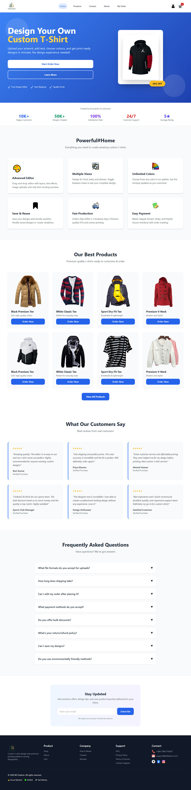
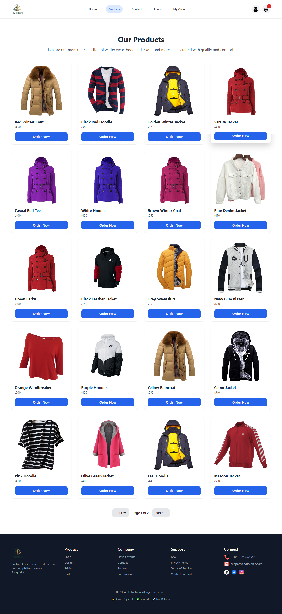
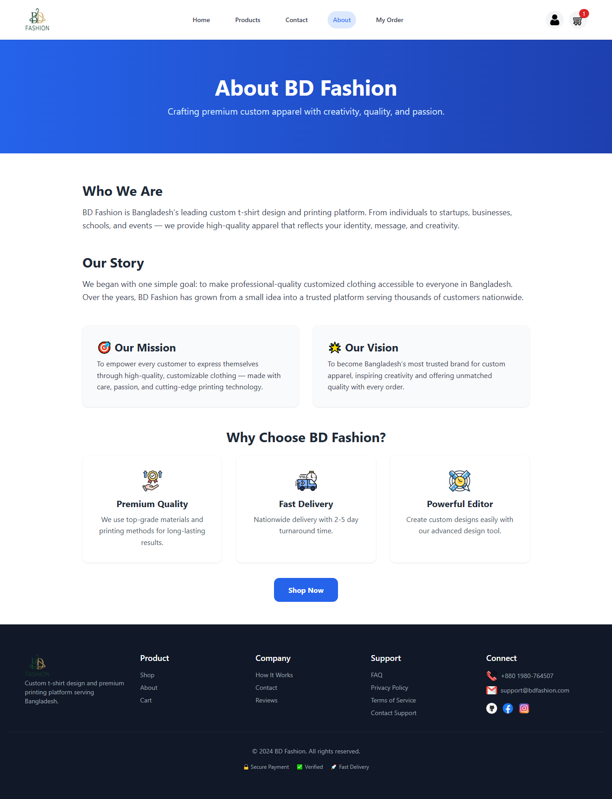

# BD Fashion

[](https://bdfashion.netlify.app/)
[](https://github.com/webhossen)

A modern, responsive e-commerce platform for custom t-shirt design and premium printing, serving Bangladesh. Create personalized apparel with our easy-to-use design studio, featuring high-quality prints, fast delivery, and secure checkout.

## Table of Contents

- [Features](#features)
- [Technologies Used](#technologies-used)
- [Prerequisites](#prerequisites)
- [Installation](#installation)
- [Usage](#usage)
- [Project Structure](#project-structure)
- [Browser Support](#browser-support)
- [Contributing](#contributing)
- [Screenshots](#screenshots)
- [Contact](#contact)
- [License](#license)
- [Acknowledgments](#acknowledgments)

## Features

### 🛍️ E-Commerce Core
- **Product Catalog**: Browse premium t-shirt styles with detailed descriptions and high-resolution images
- **Custom Design Studio**: Intuitive drag-and-drop editor for creating personalized t-shirts
- **Shopping Cart**: Add, update, and manage cart items with real-time totals
- **Secure Checkout**: Multiple payment options including bKash, cards, and mobile wallets
- **Order Tracking**: Real-time order status updates and history

### 👤 User Management
- **User Authentication**: Secure login and registration system
- **Profile Management**: Update personal information and preferences
- **Order History**: View past orders with detailed information
- **Review System**: Rate and review products with star ratings

### 🎨 Design & Customization
- **Advanced Editor**: Layer-based design tool with text, images, and shapes
- **Multiple Views**: Design front, back, and sleeves of t-shirts
- **Color Palette**: Unlimited color options for shirts and prints
- **Template Library**: Save and reuse custom designs
- **Real-time Preview**: See designs on 3D t-shirt mockups

### 📱 User Experience
- **Responsive Design**: Optimized for desktop, tablet, and mobile devices
- **Fast Loading**: Optimized images and efficient code structure
- **Accessibility**: WCAG compliant design with proper ARIA labels
- **Progressive Web App**: Installable on mobile devices

### 🛠️ Admin Features
- **Product Management**: Add, edit, and remove products
- **Order Management**: Process and track customer orders
- **User Management**: View and manage user accounts
- **Analytics Dashboard**: Basic sales and user statistics

## Technologies Used

- **Frontend**: HTML5, CSS3, JavaScript (ES6+)
- **Styling**: Tailwind CSS (v2.x)
- **Icons**: Flaticon.com
- **Data Storage**: LocalStorage for client-side data persistence
- **Build Tools**: None (static site)

## Languages and Versions

All pages are built using:
- **HTML**: HTML5
- **CSS**: CSS3 with Tailwind CSS framework (v2.x)
- **JavaScript**: ES6+ (ECMAScript 2015+)

### Page Language/Version Matrix

| Page | Filename | HTML | CSS | JavaScript | Description |
|------|----------|------|-----|------------|-------------|
| Home | `index.html` | HTML5 | CSS3 + Tailwind v2.x | ES6+ | Landing page with featured products and hero section |
| Products | `products.html` | HTML5 | CSS3 + Tailwind v2.x | ES6+ | Product catalog with filtering and search |
| Product Detail | `product-detail.html` | HTML5 | CSS3 + Tailwind v2.x | ES6+ | Individual product page with customization options |
| Cart | `cart.html` | HTML5 | CSS3 + Tailwind v2.x | ES6+ | Shopping cart management |
| Checkout | `checkout.html` | HTML5 | CSS3 + Tailwind v2.x | ES6+ | Secure payment and order placement |
| Order | `order.html` | HTML5 | CSS3 + Tailwind v2.x | ES6+ | Order confirmation and details |
| Order History | `order-view.html` | HTML5 | CSS3 + Tailwind v2.x | ES6+ | Past orders and tracking |
| Login | `login.html` | HTML5 | CSS3 + Tailwind v2.x | ES6+ | User authentication |
| Profile | `profile.html` | HTML5 | CSS3 + Tailwind v2.x | ES6+ | User account management |
| About | `about.html` | HTML5 | CSS3 + Tailwind v2.x | ES6+ | Company information and story |
| Contact | `contact.html` | HTML5 | CSS3 + Tailwind v2.x | ES6+ | Contact form and information |

Page-specific details:
- All HTML pages use semantic HTML5 structure
- CSS files use CSS3 with Tailwind utility classes for responsive styling
- JavaScript files use modern ES6+ features including arrow functions, async/await, and DOM manipulation

## Prerequisites

- Modern web browser (Chrome 70+, Firefox 65+, Safari 12+, Edge 79+)
- Internet connection for loading external resources (Tailwind CSS, icons)
- No server-side requirements (static site)

## Installation

1. **Clone the repository**:
   ```bash
   git clone https://github.com/webhossen/bd-fashion.git
   cd bd-fashion
   ```

2. **Open in browser**:
   - Open `index.html` in your preferred web browser
   - No build process or server setup required

3. **Optional: Run locally with a server** (for better development experience):
   ```bash
   # Using Python (if installed)
   python -m http.server 8000

   # Using Node.js (if installed)
   npx serve .

   # Then open http://localhost:8000 in your browser
   ```

## Usage

### For Customers
1. **Browse Products**: Visit the home page to see featured t-shirts
2. **Customize**: Click "Start Designing" to use the design studio
3. **Add to Cart**: Select your custom design and add to cart
4. **Checkout**: Complete payment with your preferred method
5. **Track Order**: Monitor your order status in your profile

### Key Workflows
- **Design Creation**: Home → Products → Design Studio → Cart → Checkout
- **Order Tracking**: Profile → Order History → Order Details
- **Account Management**: Login → Profile → Update Information

## Project Structure

```
bd-fashion/
├── index.html                    # Home page with hero and featured products
├── products.html                 # Product catalog and design studio access
├── product-detail.html           # Individual product customization
├── cart.html                     # Shopping cart management
├── checkout.html                 # Payment and order placement
├── order.html                    # Order confirmation
├── order-view.html               # Order history and tracking
├── login.html                    # User authentication
├── profile.html                  # User profile and settings
├── about.html                    # Company information
├── contact.html                  # Contact form and details
├── CSS/
│   ├── Login.css                 # Login page specific styles
│   ├── nav.css                   # Navigation component styles
│   ├── order-view.css            # Order history page styles
│   ├── products.css              # Product catalog styles
│   └── styles.css                # Global styles and utilities
├── js/
│   ├── auth.js                   # Authentication and session management
│   ├── cart.js                   # Cart functionality and persistence
│   ├── checkout.js               # Payment processing logic
│   ├── contact.js                # Contact form handling
│   ├── demo-payment-gateway.js   # Demo payment integration
│   ├── header.js                 # Navigation and header logic
│   ├── index.js                  # Home page interactions
│   ├── login.js                  # Login form validation
│   ├── order-view.js             # Order history display
│   ├── order.js                  # Order placement logic
│   ├── product-detail.js         # Product customization
│   ├── products.js               # Product data and filtering
│   ├── profile.js                # Profile management
│   ├── test-payment-gateway.js   # Test payment environment
│   └── test-payment.js           # Payment testing utilities
├── Image/                        # Static assets and product images
│   ├── man/                      # T-shirt mockup images
│   ├── favicon-*.png             # Site favicons
│   └── *.png                     # Icons and graphics
└── README.md                     # Project documentation
```

## Browser Support

- ✅ Chrome 70+
- ✅ Firefox 65+
- ✅ Safari 12+
- ✅ Edge 79+
- ✅ Mobile browsers (iOS Safari, Chrome Mobile)

## Contributing

We welcome contributions! Please follow these steps:

1. **Fork the repository**
2. **Create a feature branch**:
   ```bash
   git checkout -b feature/your-feature-name
   ```
3. **Make your changes** and test thoroughly
4. **Commit your changes**:
   ```bash
   git commit -m 'Add: Brief description of your changes'
   ```
5. **Push to your branch**:
   ```bash
   git push origin feature/your-feature-name
   ```
6. **Create a Pull Request** with a detailed description

### Development Guidelines
- Follow HTML5 semantic structure
- Use Tailwind CSS utility classes for styling
- Write clean, readable JavaScript with comments
- Test on multiple browsers and devices
- Ensure responsive design works on all screen sizes

## Screenshots

### Home Page


*Modern homepage showcasing custom t-shirt design capabilities*

### Product Catalog


*Product catalog with filtering and design options*

### About Page


*Company story and brand information*

## Contact

**BD Fashion Support Team**

- 📧 **Email**: support@bdfashion.com
- 📱 **Phone**: +880 1980-764507
- 🌐 **Website**: [bdfashion.netlify.app](https://bdfashion.netlify.app/)
- 🐙 **GitHub**: [webhossen](https://github.com/webhossen)

### Business Hours
- Monday - Friday: 9:00 AM - 6:00 PM (BST)
- Saturday: 10:00 AM - 4:00 PM (BST)
- Sunday: Closed

## License

This project is licensed under the MIT License - see the [LICENSE](LICENSE) file for details.

## Acknowledgments

- **Tailwind CSS** for the utility-first CSS framework
- **Flaticon.com** for high-quality icons
- **LocalStorage API** for client-side data persistence
- **Bangladeshi developer community** for inspiration and support

---

**BD Fashion** - Bringing creativity to custom apparel since 2024.

[](https://bdfashion.netlify.app/)
*Scan to visit our website*
